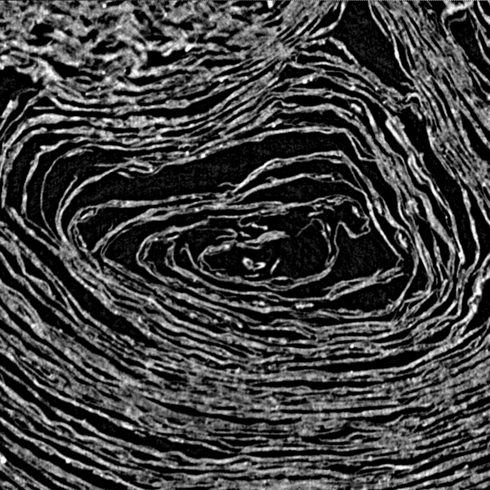

> **_NOTE:_** Now maintained at https://github.com/ScrollPrize/villa/tree/main/vesuvius-c (this repository archived)

# vesuvius-c

From [Vesuvius Challenge](https://scrollprize.org), a single-header C library for accessing CT scans of ancient scrolls.

`vesuvius-c` allows direct access to scroll data **without** managing download scripts or storing terabytes of CT scans locally:

```c
#include "vesuvius-c.h"

int main() {
    const char *scroll_id = "1";
    const int energy = 54;
    const double resolution = 7.91;

    init_vesuvius(scroll_id, energy, resolution);

    // Define a region of interest in the scroll volume
    RegionOfInterest roi = {
        .x_start = 3456, .y_start = 3256, .z_start = 6521,
        .x_width = 256, .y_height = 256, .z_depth = 256,
    };

    // Fetch this region into a local 3D volume
    unsigned char *volume = (unsigned char *)malloc(roi.x_width * roi.y_height * roi.z_depth);
    get_volume_roi(roi, volume);

    // Fetch a slice (ROI with depth = 1) from the volume
    roi.z_start = roi.z_start + roi.z_depth / 2;
    roi.z_depth = 1;
    unsigned char *slice = (unsigned char *)malloc(roi.x_width * roi.y_height);
    get_volume_slice(roi, slice);

    // Write slice image to file
    write_bmp("slice.bmp", slice, roi.x_width, roi.y_height);
}
```

Resulting image:



The library fetches scroll data from the Vesuvius Challenge [data server](https://dl.ash2txt.org) in the background. Only the necessary volume chunks are requested, and an in-memory LRU cache holds recent chunks to avoid repeat downloads.

For a similar library in Python, see [vesuvius](https://github.com/ScrollPrize/vesuvius).

> ⚠️ `vesuvius-c` is in beta and the interface may change. More data may be added in the future.

## Usage

Please accept the [data agreement](https://forms.gle/HV1J6dJbmCB2z5QL8) before use.

See [example.c](example.c) for example library usage.

## Building

### Dependencies:

* [libcurl](https://curl.se/libcurl/)
* [json-c](https://json-c.github.io/json-c/)
* [c-blosc2](https://github.com/Blosc/c-blosc2)

`libcurl` is used for fetching volume chunks and is likely already available on your system. `c-blosc2` is used to decompress the Zarr chunks read from the server and may require installation. `json-c` is used to read the zarr metadata.

### Build and run:

Link the dependencies and build your program:

```sh
gcc -o example example.c -lcurl -lblosc2 -ljson-c
./example
```

It may be necessary to point to the `c-blosc2` installation. For example, on Apple Silicon after `brew install c-blosc2`:

```sh
gcc -o example example.c -I/opt/homebrew/Cellar/c-blosc2/2.15.1/include -L/opt/homebrew/Cellar/c-blosc2/2.15.1/lib -lcurl -lblosc2 -ljson-c
./example
```

It may also be necessary to link with the system math library:

```sh
gcc -o example example.c -lcurl -lblosc2 -ljson-c -lm
./example
```

## Next features

* Reading scroll segments (`.obj` mesh files)
