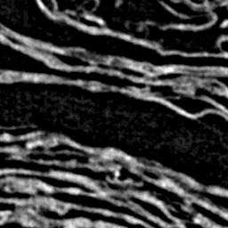

# vesuvius-c

From [Vesuvius Challenge](https://scrollprize.org), a single-header C library for accessing CT scans of ancient scrolls.

`vesuvius-c` allows direct access to scroll data **without** managing download scripts or storing terabytes of CT scans locally:

```c
#include "vesuvius-c.h"

int main() {
    init_vesuvius();

    // Read an 8-bit value from the 3D scroll volume
    int x = 3693, y = 2881, z = 6777;
    unsigned char value;
    get_volume_voxel(x, y, z, &value);
    // value <- 83

    // Define a region of interest in the scroll volume
    RegionOfInterest roi = {
        .x_start = 3456, .y_start = 3256, .z_start = 6521,
        .x_width = 256, .y_height = 256, .z_depth = 256,
    };

    // Fetch this region into a local 3D volume
    unsigned char *volume = (unsigned char *)malloc(roi.x_width * roi.y_height * roi.z_depth);
    get_volume_roi(roi, volume);
    // volume <- scroll data!

    // Fetch a slice (ROI with depth = 1) from the volume
    // ...
    get_volume_slice(roi, slice);
    // slice <- scroll data!

    // Write slice image to file
    write_bmp("slice.bmp", slice, roi.x_width, roi.y_height);
}
```

Resulting image:



The library fetches scroll data from the Vesuvius Challenge [data server](https://dl.ash2txt.org) in the background. Only the necessary volume chunks are requested, and an in-memory LRU cache holds recent chunks to avoid repeat downloads.

> ⚠️ `vesuvius-c` is in beta and the interface may change. Only Scroll 1 is currently supported. More data may be added in the future.

## Usage

See [example.c](example.c) for example library usage.

## Building

### Dependencies:

* [libcurl](https://curl.se/libcurl/)
* [c-blosc2](https://github.com/Blosc/c-blosc2)

`libcurl` is used for fetching volume chunks and is likely already available on your system. `c-blosc2` is used to decompress the Zarr chunks read from the server and may require installation.

### Build and run:

Link the dependencies and build your program:

```sh
gcc -o example example.c -lcurl -lblosc2
./example
```

It may be necessary to point to the `c-blosc2` installation. For example, on Apple Silicon after `brew install c-blosc2`:

```sh
gcc -o example example.c -I/opt/homebrew/Cellar/c-blosc2/2.15.1/include -L/opt/homebrew/Cellar/c-blosc2/2.15.1/lib -lcurl -lblosc2
./example
```

## Next features

* Volumes in addition to Scroll 1
* Reading scroll segments (`.obj` mesh files)
